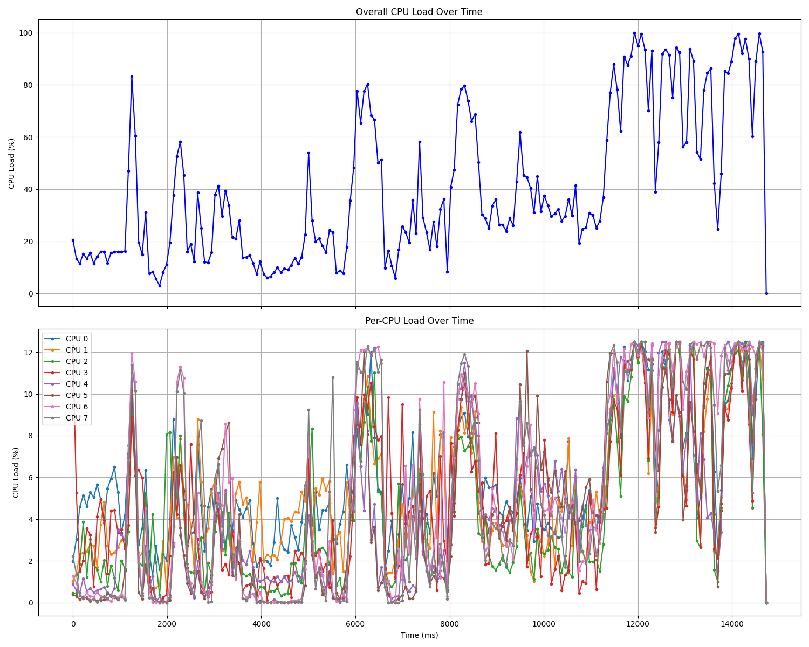

# PerfSets

It's a toolset to help dealing with `perfetto` tools:
- Automate executing & managing perfetto tracing sessions: [perf](#perf);
- Enhanced post process functions of tracing files: [draw_cpu](#draw_cpu);
- Extract logcat from a perfetto trace file that recorded with `logcat` data source enabled: [extract_logcat](#extract_logcat).

## perf
- Run perfetto tracing on an Android device.
- Collect tracing results from the device.
- Support detach mode and stop tracing by specific events

### Usage
- Regular mode: record a trace file in a specific duration. Run `perf -h` to see the options.

- Detach mode: record a trace file until a specific event happens. Run `perf detach -h` to see the options.

## draw_cpu
Calculate and visualize CPU load from Perfetto trace files.

### Installation

Ensure you have Python 3.6 or higher installed. Install the required dependencies using `pip`:

```bash
python3 -m pip install pandas tqdm matplotlib perfetto-trace-processor
```

Install `trace_processor_shell` from the github release page: https://github.com/google/perfetto/releases.

Download the latest release package according to your platform, extract all files and path of the `trace_process_shell` will be passed to the script later.

### Usage
Run the `draw_cpu.py` script with the necessary arguments:

Options:

- `-f`, `--file`: Absolute path to the trace file. (Required)
- `-b`, `--binary`: Absolute path to the trace processor binary. (Required)
- `--window_size_ms`: Window size in milliseconds. If not provided, it is automatically calculated to have approximately 200 points.
- `--window_move_ms`: Window move (step) in milliseconds. If not provided, it is calculated based on the window size.
- `--output`: Base path to save the CPU load DataFrames as CSV files. (Optional)
- `--plot`: Flag to enable plotting the CPU load curves. (Optional)
Example:
```bash
python3 draw_cpu.py -f example/example.pb -b /path/to/trace_processor_shell
```

Alternatively, run the script with accleration of the c++ plugin powered by PyBind11.
```bash
cd draw_cpu_cpp
python3 -m pip install .    # install the plugin to the current python environment

python3 draw_cpu.py -f example/example.pb -b /path/to/trace_processor_shell
```
This plugin brings a significant speedup to the script, especially when processing large trace files. In my computer, calculating CPU load for a 100MB trace file took 0.06 seconds with the plugin, compared to 20+ seconds without it.

Example output:


### Caveats
- **Trace File**: Ensure that the trace file is recorded with `sched/sched_switch` and `sched/sched_wakeup` categories enabled.
- **Trace Processor Binary**: Ensure that the trace processor binary path provided with the -b option is correct and executable.
- **Performance**: Processing very large trace files may consume significant memory and processing time.
- **Visualization**: Installing matplotlib is optional but required if you want to visualize the CPU load curves. If not installed, the script will skip the plotting step.
- **CPU Load Capping**: The script caps CPU load percentage at 100% to avoid unrealistic values.

## extract_logcat

Extract logcat from a perfetto trace file that recorded with `logcat` data source enabled.

### Installation

See the installation instructions for `draw_cpu`.

### Usage

Run the `extract_logcat.py` script with the necessary arguments:
```bash
python3 extract_logcat.py -f example/example.pb -b /path/to/trace_processor_shell -o output.log
```

## Todo
- [ ] `draw_cpu.py`: accelerate calculations by employing multi-threading.
